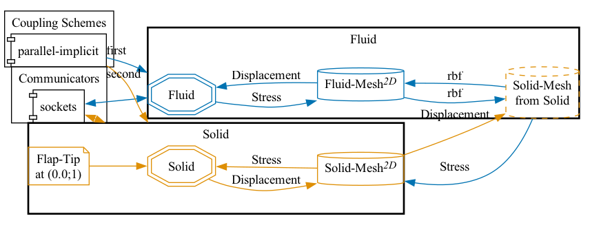
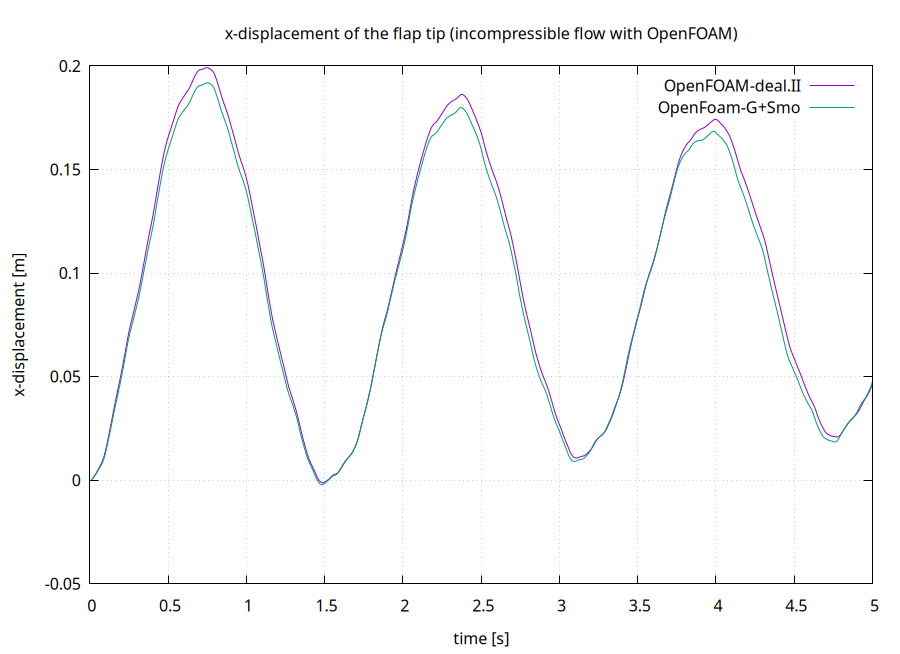


Get the [case files of this tutorial](https://github.com/precice/tutorials/tree/master/perpendicular-flap-stress). Read how in the [tutorials introduction](https://precice.org/tutorials.html).


## Setup

The scenario is exactly the same as the one described in the [perpendicular flap tutorial](https://precice.org/tutorials-perpendicular-flap.html). The only difference is that we use stresses instead of forces as data sent from the fluid to the solid participant. This requires changing the mapping constraint from conservative (forces) to consistent (stresses). To avoid a "write-consistent" combination, which [cannot be used in parallel](ttps://precice.org/configuration-mapping.html#restrictions-for-parallel-participants), we exchange both meshes.

## Configuration

preCICE configuration (image generated using the [precice-config-visualizer](https://precice.org/tooling-config-visualization.html)):



## Available solvers

Fluid participant:

* OpenFOAM (pimpleFoam). In case you are using a very old OpenFOAM version, you will need to adjust the solver to `pimpleDyMFoam` in the `Fluid/system/controlDict` file. For more information, have a look at the [OpenFOAM adapter documentation](https://precice.org/adapter-openfoam-overview.html).

Solid participant:

* G+Smo (perpendicular-flap-vertex-gismo). This solver includes both linear and nonlinear versions of the Newmark time integrator for time-dependent structural problems. The linear version iterates using a constant stiffness matrix. The nonlinear version iterates using an updated Jacobian matrix to account for material or geometric nonlinearity. By default, the solver runs in linear mode. To switch to nonlinear mode, add `--nonlinear` as option in `run.sh`. For more information, have a look at the [G+Smo adapter documentation](https://precice.org/adapter-gismo-overview.html).

## Running the simulation

Open two separate terminals and start the desired fluid and solid participants by calling the respective run scripts `run.sh` located in the participants' directories. For example:

```bash
cd fluid-openfoam
./run.sh
```

and

```bash
cd solid-gismo
./run.sh
```

## Post-processing

On the OpenFOAM side, you can open the `.foam` file with ParaView, or create VTK files with `foamToVTK`.

On the G+Smo side, you can open the `.pvd` file located in the `solid-gismo/output` folder using ParaView. If you prefer not to plot the simulation, simply edit the `run.sh` script and remove the  `--plot` option.

As we defined a watchpoint on the 'Solid' participant at the flap tip (see `precice-config.xml`), we can plot it with gnuplot using the script `plot-displacement.sh.` You need to specify the directory of the selected solid participant as a command line argument, so that the script can pick-up the desired watchpoint file, e.g. `plot-displacement.sh solid-gismo`. The resulting graph shows the x displacement of the flap tip. You can modify the script to plot the force instead.




This offering is not approved or endorsed by OpenCFD Limited, producer and distributor of the OpenFOAM software via www.openfoam.com, and owner of the OPENFOAM®  and OpenCFD®  trade marks.

